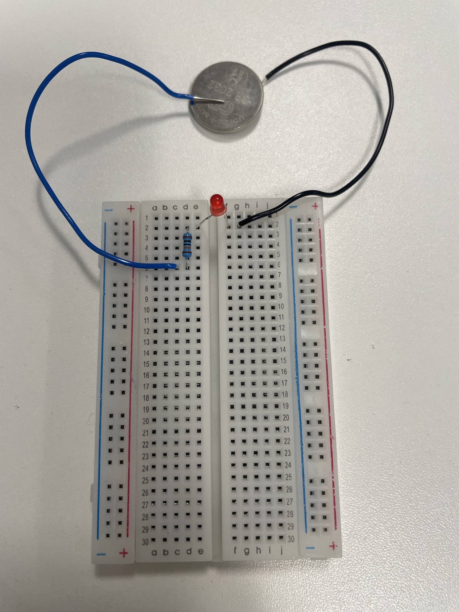
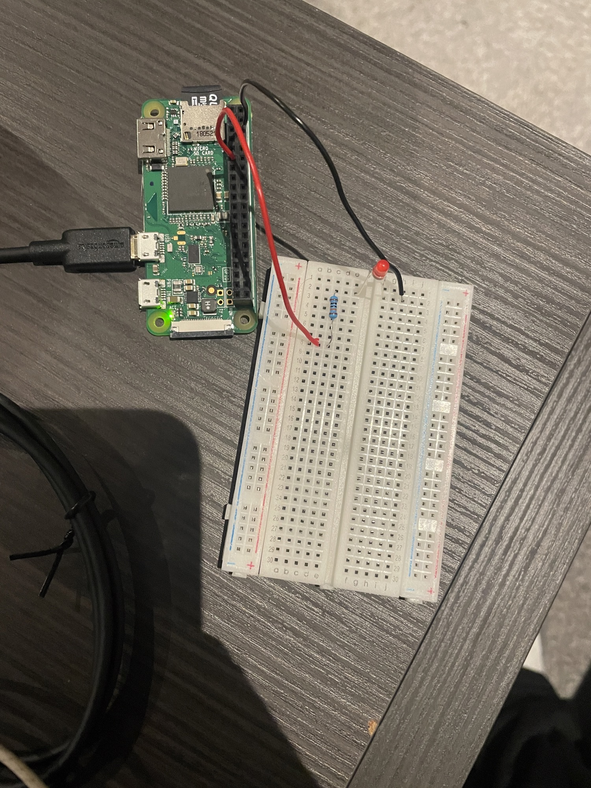
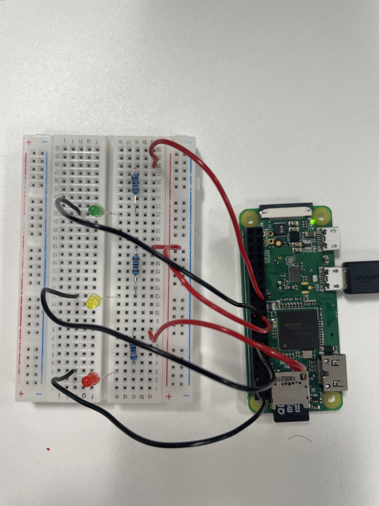

# Digital Design Worksheet

### Task 1:
###### Built a LED circuit using the following components:
1. 330 Ohm Resistor
2. An LED
3. Bread Board
4. Coin Cell Battery
5. Coil wire

* Circuit fully functional

### Task 2 :
######  Used the Raspberry Pi as the power source for the LED Circuit and implemented code (code file: led_task2.py) to allow the red LED  light to turn on for 1 second and turn off. Connected wire to port 17.
* Circuit is fully functional

### Task 3:
######  Implemented code to blink each LED light for 2 seconds in the order (Red, Yellow, Green), (code file: led_task3.py).
1. Added two more LED lights, two resistors, 4 wires. 
2. Yellow LED light connected to port 10, and Green LED light connected to port 11

* Circuit is fully functional

