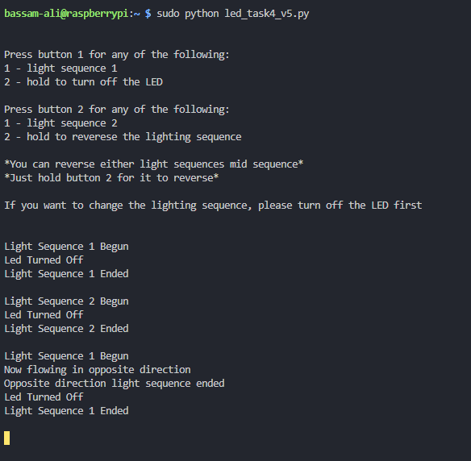

# Digital Design Worksheet

### Task 1:
###### Built a LED circuit using the following components:
1. 330 Ohm Resistor
2. An LED
3. Bread Board
4. Coin Cell Battery
5. Coil wire

* Circuit fully functional

### Task 2 :
######  Used the Raspberry Pi as the power source for the LED Circuit and implemented code (code file: led_task2.py) to allow the red LED  light to turn on for 1 second and turn off. Connected wire to port 17.
* Circuit is fully functional

### Task 3:
######  Implemented code to blink each LED light for 2 seconds in the order (Red, Yellow, Green), (code file: led_task3.py).
1. Added two more LED lights, two 330 ohm resistors, 4 wires. 
2. Yellow LED light connected to port 10, and Green LED light connected to port 11

* Circuit is fully functional

### Task 4:
###### Built on my previous circuit and added the following to it:

1. 2 buttons each with a 10 KOhm resistor
2. More Coil wires

- Button 1 allows the user to turn the LED lights on or off

- Button 2 allows the user to turn to LED lights in a reverse sequence, or change the direction of the light sequence

